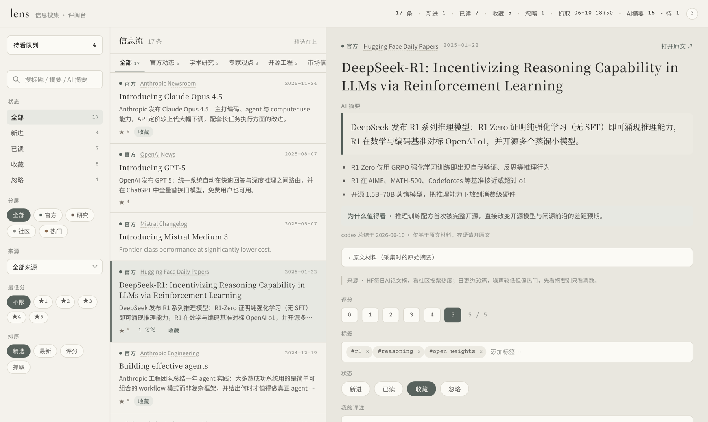

# lens

   

一个**个人 AI 信息工作台**：从你关注的一手信息源采集 → LLM 产出忠实的中文摘要 →
看板上键盘流快速评判 → 一键生成讨论稿拖给 Codex / Claude 发散 → 思考沉淀回 markdown。
它不是又一个把你淹没的 RSS reader，而是「读 → 评 → 议 → 思」的闭环控制面。

> **工具开源，思考私有**：代码和源清单公开；你的 item、打分、评论、讨论、灵感都在
> `data/` 下、git-ignored，永不进公开仓库（CI 里有隐私闸强制检查）。



## 30 秒看到效果（不采集、不跑 LLM）

```bash
git clone https://github.com/xz1220/lens.git && cd lens
pip install -r requirements.txt        # 只有 PyYAML
python3 server.py --demo --open        # 示例数据看板，离线可用（断网时字体自动降级）
```

`--demo` 用 `data.example/seed_items.json`（真实知名 AI 事件/论文/项目 + 忠实中文摘要）
重建隔离的沙盒（`data/demo.db` + `data/demo-sandbox/` 的讨论/灵感），随便玩，
重启即复原，绝不触碰你的真实数据。

## 日常使用

```bash
python3 lens.py        # 晨间一条龙：采集 → AI 总结 → 看板（自动开浏览器）
```

等价的分步命令、以及每步需要什么：

| 命令 | 干什么 | 需要 |
|---|---|---|
| `python3 server.py --demo` | 示例看板 | 无（离线可用，网页字体走 CDN、断网自动降级） |
| `python3 server.py` | 你的看板 | 无（同上） |
| `python3 collect.py` | 拉 26 个一手源 → `data/lens.db` | 网络 |
| `python3 summarize.py` | 中文摘要/要点/为什么值得看 → 回填 DB | 网络 + 本机 `codex` 或 `claude` CLI 已登录 |

总结引擎走本机 CLI 的无头模式（默认 `codex exec`，`--engine claude` 备选），
不需要配任何 API key；没装这两个 CLI 也能用看板，只是少了中文摘要。

## 闭环

```
collect ─→ digest ─→ triage ─→ discuss ─→ capture ─→ ideate
 采集       AI中文      打分/标     生成 prompt   回填讨论     记灵感
            摘要整理    状态/评论   拖进 AI 聊    /过程思考    /丢 inbox
```

## 架构

标准的前后端分离：后端拆成**生产链路**（写库）和**消费链路**（读库 + 接收你的评判），
前端是纯静态页面，只通过 JSON 接口拿数据。

```
─── 生产链路（批处理，可手动可 cron）──────────┐
                                              │
  31 个一手源 ──→ collect.py ──→ summarize.py │
                  抓取→解析→清洗   抓原文→LLM   │
                  INSERT OR IGNORE 中文总结，   │
                  入库（幂等）     只写 ai_* 列  │
                        │             │        │
                        ▼             ▼        │
                 ┌─────────────────────┐       │
                 │ SQLite data/lens.db │       │
                 └─────────────────────┘       │
                        ▲                      │
─── 消费链路 ───────────┼──────────────────────┘
                        │
   web/ 纯静态前端 ⇄ server.py（标准库 HTTP）
   fetch /api/*      读接口：stats / sources / items
   渲染三栏看板       写接口：triage / 讨论 / 回填 / 灵感
                        │
                        ▼
              data/discussions/ + data/ideas/（markdown 沉淀层，不进 DB）
```

- **生产链路**：`collect.py` 一个 adapter 一种源形态（RSS/Atom/JSON API/HTML），
  fetch 与 parse 分离（parse 是可脱网单测的纯函数）；`summarize.py` 是清洗后的
  AI 加工段。两个都是幂等批处理命令，重跑绝不覆盖你的评判。
- **消费链路**：`server.py` 只暴露 JSON 接口；它顺手托管 `web/` 静态文件是为了
  部署零依赖，逻辑边界仍然是 `/api/*`。
- **前端**：无框架、无构建步骤的 HTML/CSS/JS，换成任何别的前端只要会 fetch 就行。
- **第三层**：讨论和灵感故意落 markdown 文件而不进 DB（人读、git 友好），
  详见 `docs/VISION.md` 的数据模型。

## 键盘流（按 `?` 随时速查）

| 键 | 动作 |
|---|---|
| `j` / `k` | 下一条 / 上一条 |
| `0`–`5` | 评分 |
| `r` / `p` / `x` | 已读 / 收藏 / 忽略 —— 保存并看下一条 |
| `s` 或 `⌘S` | 保存评判并看下一条 |
| `c` / `i` | 聚焦评注框 / 灵感框 |
| `g` / `o` | 生成讨论稿 / 打开原文 |

左栏顶部的「待看队列」一键回到晨间起点：未处理的新条目按信号层级排
（官方 P0 > 研究 P1 > 社区 P2 > 热门）。切换条目不丢未保存的评判草稿。

## 结构

```
sources.yml      31 个信息源 + 接入方式 + 实测状态（源真相）
schema.sql       SQLite 表结构
lens.py          统一入口：morning / collect / digest / serve / demo / test
collect.py       采集器：一个 adapter 一种源形态，只增不覆盖你的 triage
summarize.py     AI 总结：抓原文正文 + codex/claude 无头批量产出中文摘要，只写 ai_* 字段
server.py        本地看板 + 全部读写接口（标准库 http），--demo 示例沙盒
web/             前端（墨色冷调三栏看板，无 JS 依赖；网页字体走 Google Fonts CDN）
templates/       讨论 prompt 模板（含 AI 整理结果 + 原文节选）
tests/           零网络 fixture 测试（make check 跑的就是它 + 隐私闸）
data/            你的私有数据（git-ignored）：lens.db / discussions / ideas
data.example/    公开的示例数据：demo 种子 + 结构示意
docs/            VISION（产品意图）· DECISIONS（决策记录）· SOURCES（源地图）
CLAUDE.md        给 AI 协作者的操作手册 —— 先读它
```

## 隐私边界

- `data/` 整目录 git-ignored，CI 的隐私闸会在它被意外跟踪时把构建打红。
- 采集只增不改：重跑 `collect.py` 绝不覆盖你的打分/评论；`summarize.py` 只写 ai_* 字段。
- 总结时，抓到的原文会发给你本机 CLI 背后的模型服务（codex / claude）；
  生成的讨论稿包含你的私人 comment，但它只落在本地文件——交不交给 AI、交给谁，
  都是你手动拖拽决定的。除此之外没有第三方（网页字体 CDN 除外，不带数据）。
- 看板没有鉴权，默认只绑 `127.0.0.1`。`--host` 改绑其他地址会把你的私有数据
  和写接口暴露给同网段（server 启动时会警告），别这么做。

## 贡献

最有价值的贡献是**接一个新的一手信息源**（`sources.yml` 条目 + adapter + 离线测试），
见 [CONTRIBUTING.md](CONTRIBUTING.md)。跑 `make check` = 全套零网络测试 + 隐私闸。

## License

[MIT](LICENSE)
